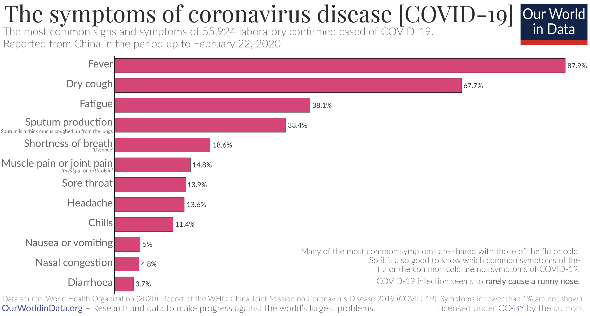
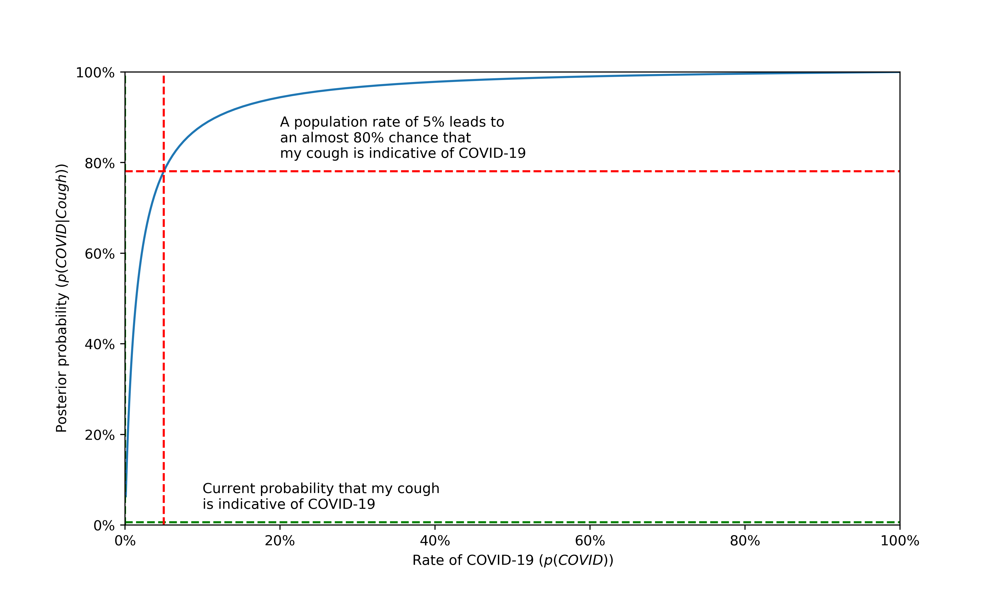

_The amount of information coming about hour-by-hour about the COVID-19 pandemic can be overwhelming. I'm writing a series of short articles called "How to think about COVID-19 like a statistician". In each post, I'll try to explain how we can all apply probability and statistics to make better sense of the data we are seeing._

Humans are notoriously bad at estimating risk, especially when uncertainty and fear are involved. The COVID-19 pandemic has released more data and news than almost any other single event in recent memory. As a data scientist, I want to explore some of this data to help understand what we should make of the numbers. In this post, I'm going to attempt to answer the question, "if I have some symptoms, how likely is it that I have COVID-19 and what should I do about it?"

I found myself having this thought as I sat in one of my last in-person classes last week, before everything moved online. I couldn't help but notice a nagging tickle in my throat, something that I would have otherwise written off as a sore throat or maybe a cold. Over the course of an hour, I became absolutely convinced that I had COVID-19 and started frantically texting my friends, many of whom were also experiencing small coughs or runny noses.

Now, as far as I know, neither myself, nor any of my friends or family have COVID-19, so it seems that that cough was nothing more than my brain fixating on something irrelevant. This isn't an isolated phenomenon: many people I know have been telling me that any sign of illness could be COVID-19, which is much scarier than the common cold. And they might be right. Or not.

**tl;dr in all likelihood you don't have COVID-19, but you could and you should _definitely_ still self-isolate if you are showing symptoms.**

### What are the symptoms?

According to the WHO, these are the main symptoms of COVID-19 (graphic from [Our World In Data](https://ourworldindata.org/coronavirus)):

As you can see, the main symptoms are fever and dry cough, as well as fatigue, sputum (phlegm), shortness of breath, joint pain, sore throat, etc. In other words, COVID-19 has symptoms that are very similar to those of a common cold or flu. However, it seems to be the case that COVID-19 is _not_ associated with a runny nose.

Now a couple things to note here. First, the data come from the WHO's joint mission in China out of a survey of roughly 56,000 confirmed cases of COVID-19. As I will continuously come back to, **the confirmed cases are not all the cases.** It is entirely likely that this underestimates more mild symptoms that might fly under the radar of the limited tests in most places. Second, this is just in China, which may or may not be representative of the global situation. Perhaps it is the case that some symptoms that might be remarkable in one country might be so common in China that they are not even counted as symptoms, or vice versa. For instance, perhaps in Wuhan, air pollution was worse than in Canada, so certain respiratory symptoms may have flown under the radar.

That being said, this is the best data we have so far, so we should still use it, given all those caveats I just mentioned. So, let's go back to the tickle in my throat and let's say that it develops into a full on dry cough. The question is, what are the chances that I have COVID-19? Perhaps we might instinctively say 68%, since that's the percent of cases of COVID-19 that present with a cough. But this neglects the very real possibility that my cough is caused by something completely different. We need a more rigorous way of thinking about this.

### Thinking like a statistician: Bayes Theorem

Luckily for us, statistics has just the trick, discovered by an 18th century minister named Thomas Bayes: Bayes' Theorem (commonly seen in textbooks and tattooed on the arms of statisticians everywhere). Bayes' theorem gives us a way to take our initial belief about some hypothesis (such as, do "I have COVID-19") and to _update_ our belief in that hypothesis after observing some data. Mathematically,

$$
p(H\mid D) = \frac{p(D\mid H)p(H)}{p(D)}
$$

Let me explain what this means. $$p(\cdot)$$ is a probability function (it tells us the probability of whatever is inside the parentheses), $$D$$ is our data, and $$H$$ is our hypothesis. The vertical bar '\|' denotes conditional probability; $$p(H\mid D)$$ should be read as "the probability of the hypothesis _given_ the data."

A bit more terminology: $$p(H)$$ is called our _prior_, and it basically represents our belief in our hypothesis $$H$$ before we observe any data. $$p(D\mid H)$$ is called the _likelihood_, and it represents the probability of observing the data $$D$$ that we did observe if our hypothesis were in fact true. $$p(D)$$ is called the _evidence_ and it represents the probability of the data we observed average over the worlds where our hypothesis is true and where it is false. Finally, $$p(H\mid D)$$ is our _posterior_ and it is what we are interested in: the probability of our hypothesis being true after we observe the data.

In other words, Bayes' theorem lets us take our background knowledge, make some observations, and tell us what the most reasonable thing to think is given all our evidence. Sounds great! (If you still need a bit more intuition behind Bayes' Theorem, you can check out [this Scientific American blog post](https://blogs.scientificamerican.com/cross-check/bayes-s-theorem-what-s-the-big-deal/)).

Let's apply it to the case of COVID-19 and my cough:

$$
    p(COVID\mid cough) = \frac{p(Cough\mid COVID)p(COVID)}{p(Cough)}
$$

So this is saying that the probability that I have COVID, given that I have a cough, depends not just on the probability of having a cough as a symptom of COVID, but also the background rate of having COVID _and_ having a cough.

We can start to fill in these numbers. We know that the probability of having a cough with COVID ($$p(Cough\mid COVID)$$) is roughly 68%, from above. As well, we can set $$p(COVID)$$ to be the rate of COVID-19 in our own country (in my case, Canada). At the time of writing, we have 3,409 cases in a country of 37.59 million, according to [CTV News](https://www.ctvnews.ca/health/coronavirus/tracking-every-case-of-covid-19-in-canada-1.4852102). That's a probability of $$p(COVID) = \frac{3,409}{37.59\times 10^{6}} = 0.00907\%$$. Now, that might not seem like a whole lot, but we should keep in mind that this is likely a significant underestimate due to (1) low testing rates, (2) long incubation periods during which individuals may show no symptoms, and (3) exponential growth of the virus. More on those in future posts.

This just leaves the evidence $$p(Cough)$$. It's generally impossible to estimate this directly. Instead, we use a rule of probability that allows us to break up $$p(Cough)$$ into two _conditional probabilities_, both of which we can estimate directly:

$$
    p(Cough) = p(Cough\mid COVID)p(COVID) + p(Cough\mid Not\; COVID)p(Not\; COVID)
$$

This is essentially saying that the overall probability of having a cough is a _weighted average_ of the probabilities from all the different ways you can have a cough.

We already know the first term, but the second term is a bit trickier. We need to determine all the ways in which a person might have a cough in order to account for the probability of having a cough without having COVID. For simplicity, let's assume that the two main causes of the kind of cough I am having might be the common cold or a flu:

$$
    p(Cough\mid Not\; COVID) = p(Cough\mid Cold)p(Cold) + p(Cough\mid Flu)p(Flu)
$$

And because this is mainly an illustrative article, I'm going to make the following assumptions about these numbers:

- Having a cough with a cold: $$p(Cough\mid Cold) = 80\%$$
- Having a cough with a flu: $$p(Cough\mid Flu) = 40\%$$
- Having a cold: $$p(Cold) = 1\%$$
- Having a flu: $$p(Flu) = 0.5\%$$

To make sense of these numbers, saying that I have a 1% chance of having a cold means that on any given day, I should expect that 1 out of every 100 people I randomly select will have a cold. Whether you agree with these numbers or not, we can easily change them later to update our estimates.

So plugging these in,

$$
    p(Cough\mid Not\;COVID) = (0.80)(0.01) + (0.40)(0.005) = 0.01 = 1\%
$$

We can then use this in the original formula:

$$
    p(COVID\mid Cough) = \frac{(0.677)(0.0000907)}{(0.677)(0.0000907) + (0.01)(1 - 0.0000907)} \\
    p(COVID\mid Cough) = 0.0061 = 0.61\%
$$

So my probability of having COVID-19 went from 0.00907% to 0.61% after observing my cough. One might say, "whoa! That's an increase of more than 50x!". But truly, the probability is still quite small. In all likelihood, my cough shouldn't keep me up at night.

### So what should I do?

Does this mean that I have no reason to be worried, and that I shouldn't bother with all this social distancing and added hygiene? **Absolutely not**. Remember when I mentioned before that the true rate of COVID-19 might be _much, much_ higher than reported? Some experts, such as Harvard T.H. Chan School of Public Health professor Marc Lipsitch have said that COVID-19 could infect up to [60% of the world population](https://www.hsph.harvard.edu/news/features/coronavirus-covid-19-press-conference-with-marc-lipsitch-03-20-20/). Based on the formula above, if $$p(COVID)$$ gets much higher, then the chances that your cough is an indicator of COVID-19 skyrocket. This figure shows, based on the math we did above, how the percentage of people with COVID-19 affects the probability that my cough is indicative of the virus:

**Based on the above assumptions for the common cold and flu, even a small increase in the rate of COVID-19 can dramatically increase the probability that a cough is evidence of a COVID-19.**

But even if cases don't reach those catastrophic levels, we should still be practicing social distancing because of another scary fact about COVID-19:

### Asymptomatic cases: the silent spread

There are emerging reports that one of the main drivers of COVID-19's spread is huge numbers of asymptomatic cases. That is, the long incubation period ([on average 5, but as many as 14 days](https://www.eurosurveillance.org/content/10.2807/1560-7917.ES.2020.25.5.2000062)) and the fact that [you can be infectious without ever showing symptoms](https://www.nature.com/articles/d41586-020-00822-x) means that the math we've done here, although it might give me peace of mind that my cough is nothing to worry about, shouldn't encourage me to go outside and see my friends. These asymptomatic cases make it singularly difficult to understand the risk of any of human contact, because it increases the chance that someone _without any symptoms_ could be a vector for the disease, including me or you. It should go without saying that none of us want to be the reason that one of our friends or family got sick, so _please_ follow public health directives and stay home!

### Next steps

This is just the first post in this series. If this answered any questions you had, raised new ones, or helped you make better sense of the data you are seeing everyday, please leave me a comment! Also, if you have other questions that you would still like answered from a statistical/probabilistic perspective, I'd love to hear them.

### Further reading

- [Our World In Data](https://ourworldindata.org/coronavirus) has an excellent set of articles on COVID-19 that are constantly updated with the newest numbers.
- [Thomas Pueyo](https://medium.com/@tomaspueyo/coronavirus-act-today-or-people-will-die-f4d3d9cd99ca) has written two highly cited articles on Medium that use data to explain why COVID-19 is worse than it seems and the trajectories that this pandemic might take depending on how governments and individuals act.
- [Tableau](https://www.tableau.com/covid-19-coronavirus-data-resources) has consolidated several data sources into a convenient Data Resource Hub with a publicly available dashboard.
- [The London School of Hygiene and & Tropical Medicine](https://vac-lshtm.shinyapps.io/ncov_tracker/) has an interactive dashboard tracking the spread of COVID-19 as well.
