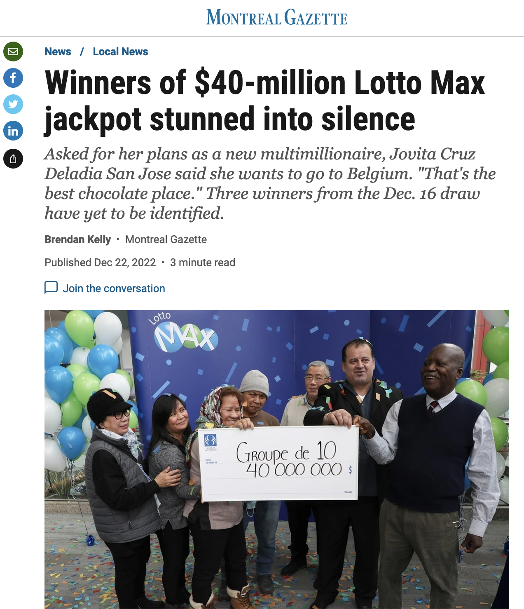

Every election cycle, there is no shortage of articles, tweets, and blog posts claiming that the author can accurately predict the outcome of the impending vote. This past midterm election in the US was no different, perhaps with the exception that those in the "this time may be different" camp actually got it right. Democrats ended up significantly [outperforming](#) most expectations, with minimal losses in the house and _gains_ in the senate, despite their incumbent president's negative approval rating.

Although I don't personally try to make public predictions about who will win upcoming elections, I confess to be an avid-bordering-on-obsessive reader of those who do. Forecasts from [FiveThirtyEight](#) and The [Economist](#) are probably among my most checked websites around election time (*Note to self: write a data-driven article on how often I check those websites based on whether there is an election going on*). Along with these poll aggregators, there is no shortage of articles written about people making bold claims that their model, based on such-and-such factors, can accurately predict the outcome, contrary to any conventional wisdom or polling data.

During the 2020 election in particular, there were tons of these types of articles. Here's an excerpt of one, from the [New York Times](https://www.nytimes.com/2020/08/05/opinion/2020-election-prediction-allan-lichtman.html):

> Right now, polls say Joe Biden has a healthy lead over President Trump. But we’ve been here before (cue 2016), and the polls were, frankly, wrong. One man, however, was not. The historian Allan Lichtman was the lonely forecaster who predicted Mr. Trump’s victory in 2016 — and also prophesied the president would be impeached. That’s two for two. But Professor Lichtman’s record goes much deeper. In 1980, he developed a presidential prediction model that retrospectively accounted for 120 years of U.S. election history. Over the past four decades, his system has accurately called presidential victors, from Ronald Reagan in ’84 to, well, Mr. Trump in 2016.

To save you from watching the video (although you should!) Prof. Allan Lichtman predicts that Biden would win based on his "13 keys" checklist.

And another from [Stony Brook University](https://news.stonybrook.edu/facultystaff/maverick-modeller-helmut-norpoth-predicts-another-win-for-trump/):

> Political scientist Helmut Norpoth fields media calls every week seeking comment on the upcoming presidential election. Why the interest? In 2016, he was one of a handful of experts who correctly predicted the outcome of the U.S. Presidential election.
[...] In 2020, his model once again projects a Trump victory, giving the incumbent President a 90-percent chance of being re-elected in a landslide — a controversial call that runs contrary to current polls.
The Primary Model has correctly predicted five of the past six presidential elections, and when applied to previous elections, correctly predicts an impressive 25 of the last 27, missing only the 2000 election in which George W. Bush defeated Al Gore and the 1960 election in which John F. Kennedy defeated Richard Nixon — two extremely close and contested votes marred by allegations of voting inaccuracies.

Aside from the fact that these forecasters come to radically different conclusions with their respective "models" (the former for Biden, the latter for Trump), these two articles are actually quite similar

**How to write a convincing forecast**

- This forecaster is known for going against the mainstream
- They correctly called X out of the last Y elections, including the all-important 2016 election
- The model is simple, ideally reducible to an easily enumerable number of factors
- There is some causal reason why their model should be expected to work
- Any forecasting misses can be explained away (it was a close election, there were irregularities, the popular vote went the other way, etc.)

Both of the above excerpts demonstrate most, if not all, of these elements. We can distill it to an even more pure form, by giving the above recipe to ChatGPT!

<blockquote>
Professor Mary Jones, a well-known election forecaster known for going against the mainstream, is predicting that Donald Trump will win the 2024 presidential election.

Professor Jones has a strong track record of accurately predicting presidential elections, correctly calling seven out of the last eight, including the important 2016 election. Her model is based on a few key factors that she believes are crucial in determining the outcome of an election.

First, Professor Jones looks at the incumbent's approval rating. If the incumbent has a high approval rating, it is generally an indication that they will be re-elected. Second, she looks at economic indicators such as GDP growth and unemployment rates. A strong economy is typically good for the incumbent party. Finally, she considers the state of international relations, as foreign policy can also play a role in election outcomes.

There is a clear causal reason why Professor Jones' model should be expected to work. She has carefully studied historical data and identified patterns that have consistently proven to be reliable indicators of election outcomes.

While Professor Jones was wrong in the 2000 election, in which George W. Bush won a controversial victory over Al Gore, she has a good explanation for her error. The 2000 election was extremely close, with irregularities and legal challenges that made it difficult to predict the outcome. In addition, the popular vote went to Gore, indicating that the result was not a clear-cut victory for Bush.

Despite these challenges, Professor Jones remains confident in her prediction that Trump will win the 2024 election. While it is too early to say for certain how the election will play out, Professor Jones' track record and carefully developed model suggest that she may be onto something.
</blockquote>

## Superforecasters?

As fun as it is to have ChatGPT write my article for me, what I actually want to talk about isn't so much the journalism as the stats. Specifically, I want to show why we should probably be more skeptical of these kinds of claims.

What do we mean when we ask if a claim is credible or not? As a data scientist, I often want to know whether something is due to pure chance (i.e., the person making the claim got lucky) or because of some actual effect happening in the world. People get lucky all the time – e.g., winning the lottery – but I hope you can recognize that a lottery winner doesn't have a real get-rich-quick scheme; they just got lucky.

<figure>
    
    <figcaption
        style="font-size: smaller; text-align: center; font-style: italic;"
    >
        Great for her! But not a great business strategy, in general.
    </figcaption>
</figure>

## Let's get formal!

We can formalize this notion:

> A claim is credible if the probability of it being true due to pure randomness is very small.

Let's unpack this a bit more. What do we mean by...

1. Probability
1. Pure randomness
1. Very small

### Probability

I could write a whole other article (actually, a series of books, if I had the time) on defining probability. But for our purposes, we can conceive of probability as measuring "how surprising something is": the lower the probability of an event, the more surprised we should be if it occurs.

Although this definition is subjective, it does allow for us to quantify the probability of an event given certain assumptions. For example, say you have two dice and you want to calculate the probability of rolling a 9 or greater. If you assume that the dice are fair (equally likely to land on any number) and that the throws of the dice are independent (e.g., the thrower is not learning how to manipulate the dice over time), using the identical set of dice, then you can show that the probability is 5/18, or roughly 28%.

### Pure randomness

Once again, books could be written on this. I think most of us can intuitively grasp what randomness is (a kind of, "I'll know it when I see it" recognition). Some possible definitions include:

1. A random process is one that cannot be reliably predicted
1. A random process is based on a random physical event (e.g., the fission of a single unstable particle)

Note that definition (1) is a subjective definition that depends on the amount of information that you have, so a process might be more or less random depending on, e.g., the sample size in your survey. Definition (2), on the other hand, is quite restrictive: only purely chaotic processes, like the breakdown of unstable atoms, fair coin flips, and the like, would count as random.

The trick that a lot of statisticians play is to model type 1 systems (theoretically predictable processes about which we have incomplete information) as type 2 systems (a series of coin flips, dice rolls, etc.). An advantage of type 2 systems is that although they are fundamentally unpredictable at an event level (you can't predict the outcome of any single fair coin toss), they are quite nicely behaved at an aggregate level (you can quite reliably predict the half-life of a sample of a sample of Carbon-14). We will be using this trick in a little bit.

### Very small

What do we mean when we say "very small"? You may have heard about P-values in many scientific fields, where a P-value below a certain threshold (traditionally 0.05) indicates that some result is significant (i.e., not due to chance). This is one way of defining "small" - set a threshold and state that everything below it is "small enough" to be an important outcome.

Hearkening back to our definition of probability as degrees of surprise, this is essentially defining what a "surprising" outcome means. And in that sense, it's not so mysterious: a P-value of 0.05 means that if we were running an experiment, but in truth the result was due to randomness and the experiment was measuring nothing real, we would still expect to see the result we observed (or one more extreme) in 5% of cases.

Given this, we can set whatever threshold we like, depending on the specific doman, and change that threshold depending on other factors in the experiment too. Should we allow ourselves to be surprised 1% of the time due to a random process? What about 10%? Ultimately, this is a subjective judgment - there is nothing special about the number 0.05 vs. 0.049 or 0.051.

## Evaluting election forecasts like a data scientist

Armed with these definitions and concepts, we can start to evaluate the claims of these election forecasters. Specifically, I want to look at the claim that the forecaster correctly predicted the last "X out of Y" elections, which we are to take as evidence that their model will correctly predict the next election as well.

Let's time-travel back to pre-election 2020 (not that anyone would want to, though - I don't think my heart could take it). Prof. Helmut Norpoth claims that his model correctly predicted the last 5/6 elections (including 2016!) and therefore we should trust his call on this election.

We can assume that the outcome of the election is not, to any meaningful degree, due to pure randomness. I.e., people aren't going into voting booths with tiny samples of Cesium-137 and voting Democrat if a particle decays within the next 5 minutes (I hope!). Instead, the election is a type 1 process - the randomness is due to our incomplete information.

However, we can still model it as a type 2 process. At the simplest level, we can say our event of interest is *whether the forecast is right or wrong*. There are the following outcomes (called the "event space"):

| True result | Predicted result | Prediction outcome |
| ----------- | ---------------- | ------------------ |
| Biden wins  | Biden wins       | Correct            |
| Biden wins  | Trump wins       | Incorrect          |
| Trump wins  | Biden wins       | Incorrect          |
| Trump wins  | Trump wins       | Correct            |

The forecast will be right in 2/4 cases. If we assume that (1) the election is a coin toss and (2) the forecast is a coin toss, there is a 50% probability of being right in any given election.

If each election is a coin toss, then we can simply model the probability of being right for 5 out of the last 6 coin tosses by multiplying together the probabilities:

$$
    P(\text{Right 5 times}) = 0.5 \times 0.5 \times 0.5 \times 0.5 \times 0.5 =  0.03125\\
    P(\text{Wrong 1 time}) = 0.5
$$

However, there are 6 different ways to have been wrong once (you could be wrong for the first, second, third, ... election). So, we multiply the result by 6:

$$
    P(\text{Right 5 times; wrong 1 time}) = P(\text{Right 5 times}) \times P(\text{Wrong 1 time}) \times 6 \\
    = 0.09375 \approx 0.1
$$

So we have a roughly 1 in 10 chance of calling 5 out of the last 6 elections with the dumbest possible model (a coin).

## Are you surprised?

Is this small enough? Should we be so surprised by the fact that Prof. Norpoth has called this many elections successfully that we should believe his claims about the 2020 election?

Personally, I don't think this crosses a threshold for me that I would throw out all other forecasts in favour of this one political scientist. This is especially the case for me given that there are many other forecasters with similar track records, like Prof. Lichtman, from the New York Times, who are making alternative predictions. At the very least, this forecasting record is not a "knockout punch" in favour of Prof. Norpoth by any stretch.

But it goes further. Up until now, we've only been talking about a single forecaster at a time, and modeling how likely it is that they would get lucky in election after election, to produce the appearance of a successful forecasting method. However, in the real world, the *data generating process is more complex*. We also need to consider whether we are seeing the full picture, or whether the media outlet reporting on these predictions are making some editorial decisions that might obscure the full picture...

*Read more in [part 2](#), where we talk about how you might create your own election-predicting scam!*